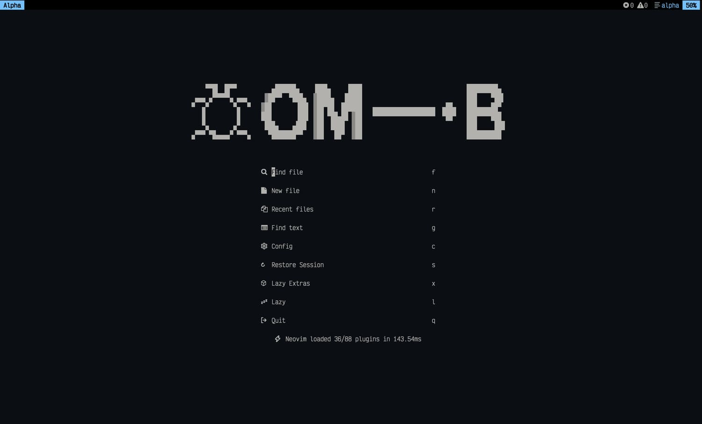
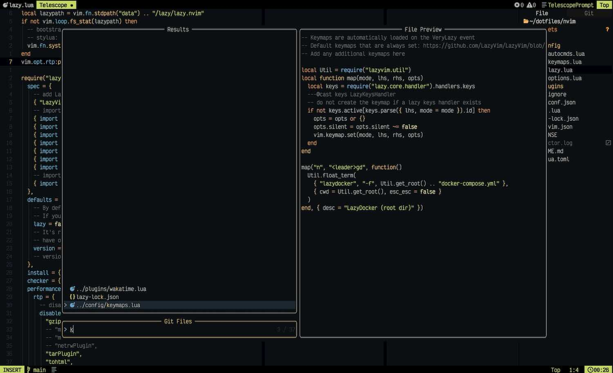

### My neovim config

<a href="https://dotfyle.com/phaberest/nvim-config"></a>
<a href="https://dotfyle.com/phaberest/nvim-config"></a>
<a href="https://dotfyle.com/phaberest/nvim-config"></a>

My config is based on 💤 [LazyVim](https://github.com/LazyVim/LazyVim).





## Install Instructions

> Install requires Neovim 0.9+. Always review the code before installing a configuration.

Clone the repository and install the plugins:

```sh
git clone git@github.com:phaberest/nvim-config ~/.config/phaberest/nvim-config
NVIM_APPNAME=phaberest/nvim-config/ nvim --headless +"Lazy! sync" +qa
```

Open Neovim with this config:

```sh
NVIM_APPNAME=phaberest/nvim-config/ nvim
```

## Plugins

### ai

- [David-Kunz/gen.nvim](https://dotfyle.com/plugins/David-Kunz/gen.nvim)

### bars-and-lines

- [SmiteshP/nvim-navic](https://dotfyle.com/plugins/SmiteshP/nvim-navic)

### color

- [NvChad/nvim-colorizer.lua](https://dotfyle.com/plugins/NvChad/nvim-colorizer.lua)

### colorscheme

- [bluz71/vim-moonfly-colors](https://dotfyle.com/plugins/bluz71/vim-moonfly-colors)
- [rebelot/kanagawa.nvim](https://dotfyle.com/plugins/rebelot/kanagawa.nvim)

### comment

- [danymat/neogen](https://dotfyle.com/plugins/danymat/neogen)

### completion

- [hrsh7th/nvim-cmp](https://dotfyle.com/plugins/hrsh7th/nvim-cmp)

### diagnostics

- [piersolenski/wtf.nvim](https://dotfyle.com/plugins/piersolenski/wtf.nvim)

### editing-support

- [Wansmer/treesj](https://dotfyle.com/plugins/Wansmer/treesj)
- [cshuaimin/ssr.nvim](https://dotfyle.com/plugins/cshuaimin/ssr.nvim)

### file-explorer

- [nvim-neo-tree/neo-tree.nvim](https://dotfyle.com/plugins/nvim-neo-tree/neo-tree.nvim)

### formatting

- [stevearc/conform.nvim](https://dotfyle.com/plugins/stevearc/conform.nvim)

### fuzzy-finder

- [nvim-telescope/telescope.nvim](https://dotfyle.com/plugins/nvim-telescope/telescope.nvim)

### lsp

- [neovim/nvim-lspconfig](https://dotfyle.com/plugins/neovim/nvim-lspconfig)
- [j-hui/fidget.nvim](https://dotfyle.com/plugins/j-hui/fidget.nvim)
- [SmiteshP/nvim-navbuddy](https://dotfyle.com/plugins/SmiteshP/nvim-navbuddy)

### lsp-installer

- [williamboman/mason.nvim](https://dotfyle.com/plugins/williamboman/mason.nvim)

### nvim-dev

- [folke/neodev.nvim](https://dotfyle.com/plugins/folke/neodev.nvim)
- [nvim-lua/plenary.nvim](https://dotfyle.com/plugins/nvim-lua/plenary.nvim)
- [MunifTanjim/nui.nvim](https://dotfyle.com/plugins/MunifTanjim/nui.nvim)

### php

- [gbprod/phpactor.nvim](https://dotfyle.com/plugins/gbprod/phpactor.nvim)

### plugin-manager

- [folke/lazy.nvim](https://dotfyle.com/plugins/folke/lazy.nvim)

### preconfigured

- [LazyVim/LazyVim](https://dotfyle.com/plugins/LazyVim/LazyVim)

### snippet

- [L3MON4D3/LuaSnip](https://dotfyle.com/plugins/L3MON4D3/LuaSnip)
- [rafamadriz/friendly-snippets](https://dotfyle.com/plugins/rafamadriz/friendly-snippets)

### startup

- [goolord/alpha-nvim](https://dotfyle.com/plugins/goolord/alpha-nvim)

### statusline

- [nvim-lualine/lualine.nvim](https://dotfyle.com/plugins/nvim-lualine/lualine.nvim)

### syntax

- [nvim-treesitter/nvim-treesitter](https://dotfyle.com/plugins/nvim-treesitter/nvim-treesitter)
- [echasnovski/mini.surround](https://dotfyle.com/plugins/echasnovski/mini.surround)

### tabline

- [akinsho/bufferline.nvim](https://dotfyle.com/plugins/akinsho/bufferline.nvim)

### utility

- [rcarriga/nvim-notify](https://dotfyle.com/plugins/rcarriga/nvim-notify)
- [echasnovski/mini.nvim](https://dotfyle.com/plugins/echasnovski/mini.nvim)

### web-development

- [roobert/tailwindcss-colorizer-cmp.nvim](https://dotfyle.com/plugins/roobert/tailwindcss-colorizer-cmp.nvim)

## Language Servers

- astro
- cssls
- docker_compose_language_service
- dockerls
- emmet_ls
- eslint
- graphql
- html
- jsonls
- lemminx
- lua_ls
- marksman
- phpactor
- prismals
- pyright
- rust_analyzer
- sqlls
- svelte
- tailwindcss
- terraformls
- tsserver
- volar
- yamlls

This readme was partially generated by [Dotfyle](https://dotfyle.com)
